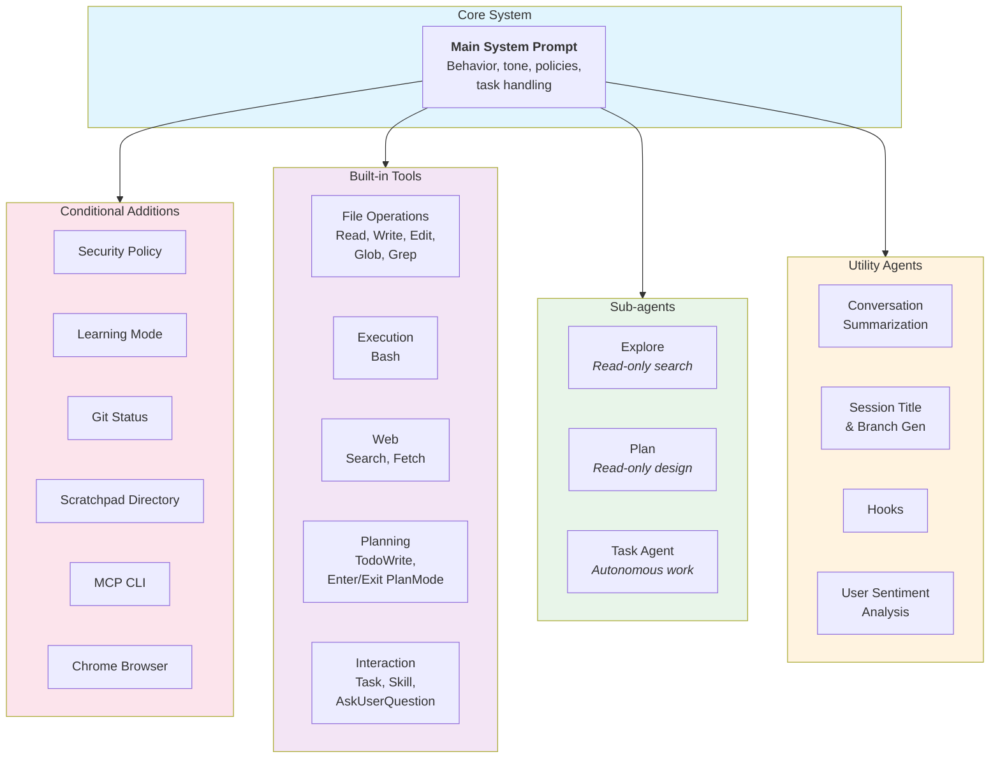

# High-Level System Architecture

This diagram shows the overall structure of Claude Code's prompt system.

## Components

| Component | Description | Key Prompts |
|-----------|-------------|-------------|
| **Core System** | The main system prompt that defines Claude Code's behavior, tone, and policies | [Main System Prompt](../system-prompts/system-prompt-main-system-prompt.md) |
| **Conditional Additions** | Context-dependent prompt sections added based on environment and configuration | [Learning Mode](../system-prompts/system-prompt-learning-mode.md), [Git Status](../system-prompts/system-prompt-git-status.md), [MCP CLI](../system-prompts/system-prompt-mcp-cli.md) |
| **Built-in Tools** | Tool descriptions injected when tools are available | See [Tool Ecosystem](./3-tool-ecosystem.md) |
| **Sub-agents** | Specialized agents spawned for complex tasks | [Explore](../system-prompts/agent-prompt-explore.md), [Plan](../system-prompts/agent-prompt-plan-mode-enhanced.md), [Task](../system-prompts/agent-prompt-task-tool.md) |
| **Utility Agents** | Background agents for session management and analysis | [Summarization](../system-prompts/agent-prompt-conversation-summarization.md), [Session Title](../system-prompts/agent-prompt-session-title-and-branch-generation.md) |
