# Agent Delegation Flow

This diagram shows how the main Claude Code agent decides when to handle tasks directly versus delegating to specialized sub-agents.

```mermaid
flowchart TB
    User["👤 User Request"]
    Main["Main Agent<br/><i>Main System Prompt</i>"]
    click Main href "../system-prompts/system-prompt-main-system-prompt.md" "Main System Prompt"

    Decision{{"Task Complexity?"}}

    subgraph Direct["Direct Tool Use"]
        direction TB
        Read["ReadFile"]
        Write["Write"]
        Edit["Edit"]
        Bash["Bash"]
        Glob["Glob"]
        Grep["Grep"]
        Web["WebSearch /<br/>WebFetch"]
        click Read href "../system-prompts/tool-description-readfile.md" "ReadFile Tool"
        click Write href "../system-prompts/tool-description-write.md" "Write Tool"
        click Edit href "../system-prompts/tool-description-edit.md" "Edit Tool"
        click Bash href "../system-prompts/tool-description-bash.md" "Bash Tool"
        click Glob href "../system-prompts/tool-description-glob.md" "Glob Tool"
        click Grep href "../system-prompts/tool-description-grep.md" "Grep Tool"
        click Web href "../system-prompts/tool-description-websearch.md" "WebSearch Tool"
    end

    subgraph TaskTool["Task Tool Delegation"]
        Task["Task Tool"]
        click Task href "../system-prompts/tool-description-task.md" "Task Tool"
        
        subgraph SubAgents["Sub-agent Types"]
            Explore["<b>Explore Agent</b><br/><i>Read-only codebase search</i><br/>Tools: Glob, Grep, Read, Bash"]
            Plan["<b>Plan Agent</b><br/><i>Read-only architecture design</i><br/>Tools: Glob, Grep, Read, Bash"]
            Custom["<b>Custom Agents</b><br/><i>User-defined via config</i>"]
            click Explore href "../system-prompts/agent-prompt-explore.md" "Explore Agent"
            click Plan href "../system-prompts/agent-prompt-plan-mode-enhanced.md" "Plan Mode Agent"
        end
    end

    TaskPrompt["Task Agent Prompt<br/><i>Given to spawned agent</i>"]
    ExtraNotes["Extra Notes<br/><i>Absolute paths, formatting</i>"]
    click TaskPrompt href "../system-prompts/agent-prompt-task-tool.md" "Task Agent Prompt"
    click ExtraNotes href "../system-prompts/agent-prompt-task-tool-extra-notes.md" "Task Tool Extra Notes"

    Result["📋 Result returned to Main Agent"]
    Response["💬 Response to User"]

    User --> Main
    Main --> Decision
    
    Decision -->|"Simple / Specific"| Direct
    Decision -->|"Complex / Multi-step"| TaskTool
    
    Task --> SubAgents
    SubAgents --> TaskPrompt
    TaskPrompt --> ExtraNotes
    
    Direct --> Response
    ExtraNotes --> Result
    Result --> Main
    Main --> Response

    style Direct fill:#e8f5e9
    style TaskTool fill:#e1f5fe
    style SubAgents fill:#f3e5f5
```

## When to Use Direct Tools vs. Task Delegation

| Scenario | Approach | Reason |
|----------|----------|--------|
| Read a specific file | **Direct** (ReadFile) | Known path, simple operation |
| Search for "class Foo" | **Direct** (Grep) | Specific needle query |
| Find all TypeScript files | **Direct** (Glob) | Simple pattern match |
| "Where are errors handled?" | **Task** (Explore) | Requires codebase exploration |
| "What's the architecture?" | **Task** (Explore) | Needs broad understanding |
| Design a new feature | **Task** (Plan) | Requires analysis and design |
| Run tests after code changes | **Task** (Custom) | Multi-step autonomous work |

## Sub-agent Characteristics

### Explore Agent
- **Purpose**: Fast, read-only codebase search
- **Constraints**: Cannot create, modify, or delete files
- **Tools**: Glob, Grep, ReadFile, Bash (read-only commands only)
- **Prompt**: [agent-prompt-explore.md](../system-prompts/agent-prompt-explore.md)

### Plan Agent  
- **Purpose**: Architecture analysis and implementation planning
- **Constraints**: Read-only, outputs a plan with critical files
- **Tools**: Glob, Grep, ReadFile, Bash (read-only commands only)
- **Prompt**: [agent-prompt-plan-mode-enhanced.md](../system-prompts/agent-prompt-plan-mode-enhanced.md)

### Task Agent (Generic)
- **Purpose**: Autonomous execution of delegated tasks
- **Prompt**: [agent-prompt-task-tool.md](../system-prompts/agent-prompt-task-tool.md)
- **Extra Notes**: [agent-prompt-task-tool-extra-notes.md](../system-prompts/agent-prompt-task-tool-extra-notes.md)
