# Tool Ecosystem

This diagram maps all of Claude Code's built-in tools, organized by category.

```mermaid
flowchart TB
    subgraph FileOps["📁 File Operations"]
        direction TB
        Read["<b>ReadFile</b><br/>Read file contents"]
        Write["<b>Write</b><br/>Create/overwrite files"]
        Edit["<b>Edit</b><br/>String replacement in files"]
        Glob["<b>Glob</b><br/>Pattern-based file search"]
        Grep["<b>Grep</b><br/>Content search with regex"]
        Notebook["<b>NotebookEdit</b><br/>Jupyter cell editing"]
        click Read href "../system-prompts/tool-description-readfile.md" "ReadFile"
        click Write href "../system-prompts/tool-description-write.md" "Write"
        click Edit href "../system-prompts/tool-description-edit.md" "Edit"
        click Glob href "../system-prompts/tool-description-glob.md" "Glob"
        click Grep href "../system-prompts/tool-description-grep.md" "Grep"
        click Notebook href "../system-prompts/tool-description-notebookedit.md" "NotebookEdit"
    end

    subgraph Execution["⚡ Execution"]
        direction TB
        Bash["<b>Bash</b><br/>Shell command execution"]
        BashGit["Git & PR Instructions<br/><i>Commit and PR creation</i>"]
        BashSandbox["Sandbox Note<br/><i>Security sandboxing</i>"]
        click Bash href "../system-prompts/tool-description-bash.md" "Bash"
        click BashGit href "../system-prompts/tool-description-bash-git-commit-and-pr-creation-instructions.md" "Git Instructions"
        click BashSandbox href "../system-prompts/tool-description-bash-sandbox-note.md" "Sandbox Note"
        
        Bash --> BashGit
        Bash --> BashSandbox
    end

    subgraph Web["🌐 Web"]
        direction TB
        WebSearch["<b>WebSearch</b><br/>Real-time web search"]
        WebFetch["<b>WebFetch</b><br/>Fetch URL contents"]
        click WebSearch href "../system-prompts/tool-description-websearch.md" "WebSearch"
        click WebFetch href "../system-prompts/tool-description-webfetch.md" "WebFetch"
    end

    subgraph Planning["📋 Planning & Tasks"]
        direction TB
        Todo["<b>TodoWrite</b><br/>Task list management"]
        Enter["<b>EnterPlanMode</b><br/>Start planning mode"]
        Exit["<b>ExitPlanMode</b><br/>Present plan for approval"]
        ExitV2["<b>ExitPlanMode v2</b><br/>Enhanced plan dialog"]
        click Todo href "../system-prompts/tool-description-todowrite.md" "TodoWrite"
        click Enter href "../system-prompts/tool-description-enterplanmode.md" "EnterPlanMode"
        click Exit href "../system-prompts/tool-description-exitplanmode.md" "ExitPlanMode"
        click ExitV2 href "../system-prompts/tool-description-exitplanmode-v2.md" "ExitPlanMode v2"
    end

    subgraph Interaction["💬 Interaction"]
        direction TB
        Task["<b>Task</b><br/>Launch sub-agents"]
        Skill["<b>Skill</b><br/>Execute skills"]
        Ask["<b>AskUserQuestion</b><br/>Clarification prompts"]
        click Task href "../system-prompts/tool-description-task.md" "Task"
        click Skill href "../system-prompts/tool-description-skill.md" "Skill"
        click Ask href "../system-prompts/tool-description-askuserquestion.md" "AskUserQuestion"
    end

    subgraph Specialized["🔧 Specialized"]
        direction TB
        Computer["<b>Computer</b><br/>Chrome browser automation"]
        LSP["<b>LSP</b><br/>Language Server Protocol"]
        MCP["<b>MCPSearch</b><br/>MCP server discovery"]
        MCPTools["MCPSearch<br/><i>with available tools</i>"]
        click Computer href "../system-prompts/tool-description-computer.md" "Computer"
        click LSP href "../system-prompts/tool-description-lsp.md" "LSP"
        click MCP href "../system-prompts/tool-description-mcpsearch.md" "MCPSearch"
        click MCPTools href "../system-prompts/tool-description-mcpsearch-with-available-tools.md" "MCPSearch with tools"
        
        MCP --> MCPTools
    end

    style FileOps fill:#e8f5e9
    style Execution fill:#fff3e0
    style Web fill:#e1f5fe
    style Planning fill:#f3e5f5
    style Interaction fill:#fce4ec
    style Specialized fill:#f5f5f5
```

## Tool Quick Reference

### File Operations
| Tool | Purpose | Prompt File |
|------|---------|-------------|
| **ReadFile** | Read file contents with optional offset/limit | [tool-description-readfile.md](../system-prompts/tool-description-readfile.md) |
| **Write** | Create or overwrite entire files | [tool-description-write.md](../system-prompts/tool-description-write.md) |
| **Edit** | Exact string replacement in existing files | [tool-description-edit.md](../system-prompts/tool-description-edit.md) |
| **Glob** | Find files by pattern (e.g., `**/*.ts`) | [tool-description-glob.md](../system-prompts/tool-description-glob.md) |
| **Grep** | Search file contents with regex | [tool-description-grep.md](../system-prompts/tool-description-grep.md) |
| **NotebookEdit** | Edit Jupyter notebook cells | [tool-description-notebookedit.md](../system-prompts/tool-description-notebookedit.md) |

### Execution
| Tool | Purpose | Prompt File |
|------|---------|-------------|
| **Bash** | Execute shell commands | [tool-description-bash.md](../system-prompts/tool-description-bash.md) |
| ↳ Git Instructions | How to create commits and PRs | [tool-description-bash-git-commit-and-pr-creation-instructions.md](../system-prompts/tool-description-bash-git-commit-and-pr-creation-instructions.md) |
| ↳ Sandbox Note | Security sandboxing info | [tool-description-bash-sandbox-note.md](../system-prompts/tool-description-bash-sandbox-note.md) |

### Web
| Tool | Purpose | Prompt File |
|------|---------|-------------|
| **WebSearch** | Search the web for real-time information | [tool-description-websearch.md](../system-prompts/tool-description-websearch.md) |
| **WebFetch** | Fetch content from specific URLs | [tool-description-webfetch.md](../system-prompts/tool-description-webfetch.md) |

### Planning & Tasks
| Tool | Purpose | Prompt File |
|------|---------|-------------|
| **TodoWrite** | Create and manage task lists | [tool-description-todowrite.md](../system-prompts/tool-description-todowrite.md) |
| **EnterPlanMode** | Enter planning mode for complex tasks | [tool-description-enterplanmode.md](../system-prompts/tool-description-enterplanmode.md) |
| **ExitPlanMode** | Present plan for user approval | [tool-description-exitplanmode.md](../system-prompts/tool-description-exitplanmode.md) |
| **ExitPlanMode v2** | Enhanced plan dialog | [tool-description-exitplanmode-v2.md](../system-prompts/tool-description-exitplanmode-v2.md) |

### Interaction
| Tool | Purpose | Prompt File |
|------|---------|-------------|
| **Task** | Launch specialized sub-agents | [tool-description-task.md](../system-prompts/tool-description-task.md) |
| **Skill** | Execute predefined skills | [tool-description-skill.md](../system-prompts/tool-description-skill.md) |
| **AskUserQuestion** | Ask user for clarification | [tool-description-askuserquestion.md](../system-prompts/tool-description-askuserquestion.md) |

### Specialized
| Tool | Purpose | Prompt File |
|------|---------|-------------|
| **Computer** | Chrome browser automation | [tool-description-computer.md](../system-prompts/tool-description-computer.md) |
| **LSP** | Language Server Protocol operations | [tool-description-lsp.md](../system-prompts/tool-description-lsp.md) |
| **MCPSearch** | Search for MCP servers | [tool-description-mcpsearch.md](../system-prompts/tool-description-mcpsearch.md) |
