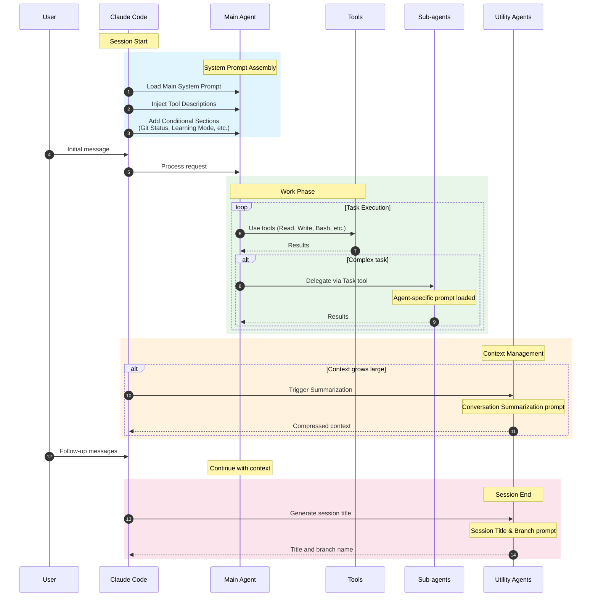
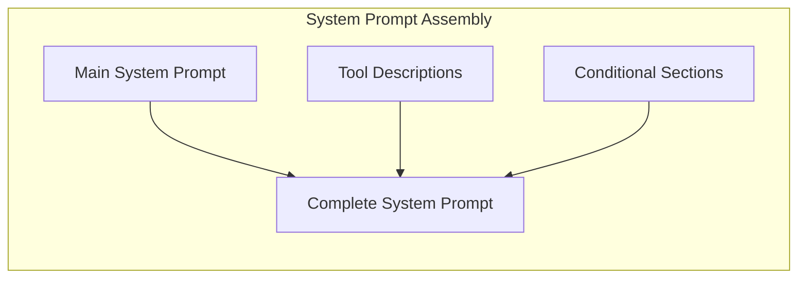
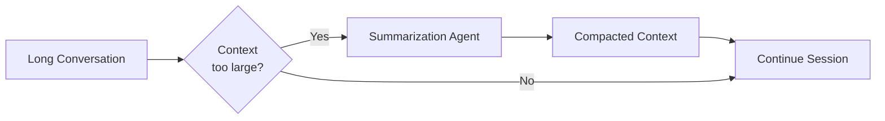

# Conversation Lifecycle

This diagram shows how different prompts are used throughout a Claude Code session, from start to finish.

## Lifecycle Phases

### 1. Session Initialization

When a Claude Code session starts, the system prompt is assembled from multiple pieces:

**Key Prompts:**
- [Main System Prompt](../system-prompts/system-prompt-main-system-prompt.md) - Core behavior and policies
- [Git Status](../system-prompts/system-prompt-git-status.md) - Repository state (if in git repo)
- [Learning Mode](../system-prompts/system-prompt-learning-mode.md) - Educational mode (if enabled)
- [Scratchpad Directory](../system-prompts/system-prompt-scratchpad-directory.md) - Temp file location (if configured)

### 2. Work Phase

During active work, the main agent uses tools and may delegate to sub-agents:

| Action | Prompts Used |
|--------|-------------|
| Direct tool use | Individual [tool descriptions](./3-tool-ecosystem.md) |
| Codebase exploration | [Explore Agent](../system-prompts/agent-prompt-explore.md) via Task |
| Planning | [Plan Agent](../system-prompts/agent-prompt-plan-mode-enhanced.md) via Task |
| Task management | [TodoWrite](../system-prompts/tool-description-todowrite.md) |

### 3. Context Management

As conversation grows, summarization preserves important context:

**Key Prompts:**
- [Conversation Summarization](../system-prompts/agent-prompt-conversation-summarization.md) - Standard summarization
- [Summarization with Additional Instructions](../system-prompts/agent-prompt-conversation-summarization-with-additional-instructions.md) - Custom summarization rules

### 4. Session End

When a session concludes, utility agents generate metadata:

**Key Prompts:**
- [Session Title & Branch Generation](../system-prompts/agent-prompt-session-title-and-branch-generation.md) - Creates descriptive title and git branch name
- [Session Notes Template](../system-prompts/agent-prompt-session-notes-template.md) - Structure for session notes
- [Session Notes Update](../system-prompts/agent-prompt-session-notes-update-instructions.md) - How to update notes during session

## Prompt Injection Points

| Phase | Injection Point | Prompt Type |
|-------|----------------|-------------|
| Start | System message | Main + conditionals |
| Tool call | Tool schema | Tool descriptions |
| Sub-agent spawn | New context | Agent prompts |
| Context compact | Background | Summarization prompt |
| Plan mode | System reminder | Plan mode reminders |
| Session end | Background | Title/branch generation |
