# Plan Mode Flow

This diagram shows the planning subsystem—how Claude Code enters, operates in, and exits plan mode.

## Plan Mode Entry Points

```mermaid
flowchart LR
    subgraph Triggers["Entry Triggers"]
        Keyboard["⌨️ Shift+Tab"]
        Tool["🔧 EnterPlanMode tool"]
        Complex["🤔 Complex task detected"]
    end
    
    subgraph Entry["Plan Mode Activation"]
        Enter["EnterPlanMode"]
        Reminder["Plan Mode Reminder<br/>injected into context"]
    end
    
    Triggers --> Entry
    
    click Enter href "../system-prompts/tool-description-enterplanmode.md" "EnterPlanMode"
    click Reminder href "../system-prompts/system-reminder-plan-mode-is-active.md" "Plan Mode Reminder"
```

**Key Prompts:**
- [EnterPlanMode Tool](../system-prompts/tool-description-enterplanmode.md) - Tool description for entering plan mode
- [Plan Mode Active Reminder](../system-prompts/system-reminder-plan-mode-is-active.md) - System reminder injected when plan mode is active

## Plan Mode Operation

While in plan mode, Claude Code operates in **read-only** mode with specific capabilities:

```mermaid
flowchart TB
    subgraph Capabilities["✅ Allowed in Plan Mode"]
        Read["Read files"]
        Search["Search codebase"]
        Analyze["Analyze patterns"]
        Design["Design solutions"]
        Parallel["Spawn parallel<br/>exploration agents"]
    end
    
    subgraph Restricted["❌ Restricted in Plan Mode"]
        Write["Write files"]
        Edit["Edit files"]
        Execute["Execute commands<br/>(except read-only)"]
        Create["Create anything"]
    end
    
    PlanAgent["Plan Mode Agent"]
    PlanAgent --> Capabilities
    PlanAgent -.->|blocked| Restricted
    
    click PlanAgent href "../system-prompts/agent-prompt-plan-mode-enhanced.md" "Plan Mode Agent"
```

**Key Prompts:**
- [Plan Mode Agent](../system-prompts/agent-prompt-plan-mode-enhanced.md) - Enhanced planning prompt
- [Plan Mode for Subagents](../system-prompts/system-reminder-plan-mode-is-active-for-subagents.md) - Simplified reminder for spawned sub-agents

## Plan Mode Exit

```mermaid
flowchart TB
    PlanReady["Plan Ready"]
    Exit["ExitPlanMode Tool"]
    
    subgraph Dialog["Plan Approval Dialog"]
        Present["Present plan to user"]
        UserChoice{{"User Decision"}}
        Approve["✅ Approve"]
        Modify["✏️ Request changes"]
        Reject["❌ Reject"]
    end
    
    PlanReady --> Exit
    Exit --> Present
    Present --> UserChoice
    UserChoice --> Approve
    UserChoice --> Modify
    UserChoice --> Reject
    
    Approve --> Implement["Begin Implementation"]
    Modify --> Continue["Continue Planning"]
    Reject --> Normal["Return to Normal Mode"]
    
    click Exit href "../system-prompts/tool-description-exitplanmode.md" "ExitPlanMode"
```

**Key Prompts:**
- [ExitPlanMode Tool](../system-prompts/tool-description-exitplanmode.md) - Standard exit tool
- [ExitPlanMode v2](../system-prompts/tool-description-exitplanmode-v2.md) - Enhanced plan dialog

## Re-entry Flow

Users can re-enter plan mode after exiting:

**Key Prompt:**
- [Plan Mode Re-entry](../system-prompts/system-reminder-plan-mode-re-entry.md) - Reminder when re-entering plan mode after implementation

## All Plan Mode Prompts

| Prompt | Purpose | File |
|--------|---------|------|
| **EnterPlanMode** | Tool to enter plan mode | [tool-description-enterplanmode.md](../system-prompts/tool-description-enterplanmode.md) |
| **ExitPlanMode** | Tool to exit with plan | [tool-description-exitplanmode.md](../system-prompts/tool-description-exitplanmode.md) |
| **ExitPlanMode v2** | Enhanced exit dialog | [tool-description-exitplanmode-v2.md](../system-prompts/tool-description-exitplanmode-v2.md) |
| **Plan Mode Agent** | Agent behavior in plan mode | [agent-prompt-plan-mode-enhanced.md](../system-prompts/agent-prompt-plan-mode-enhanced.md) |
| **Active Reminder** | Injected while plan mode active | [system-reminder-plan-mode-is-active.md](../system-prompts/system-reminder-plan-mode-is-active.md) |
| **Subagent Reminder** | Simplified reminder for sub-agents | [system-reminder-plan-mode-is-active-for-subagents.md](../system-prompts/system-reminder-plan-mode-is-active-for-subagents.md) |
| **Re-entry Reminder** | When re-entering after exit | [system-reminder-plan-mode-re-entry.md](../system-prompts/system-reminder-plan-mode-re-entry.md) |
