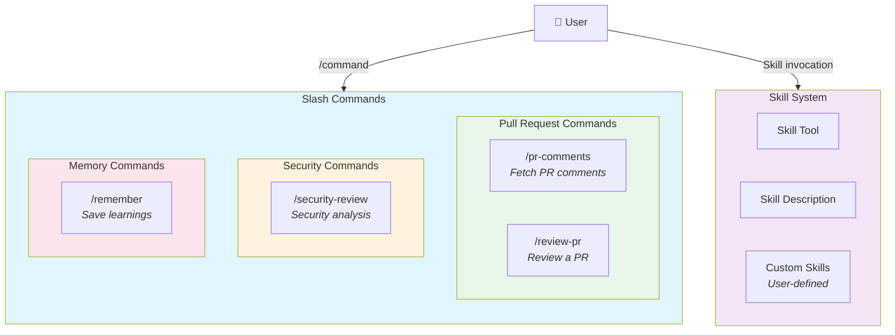
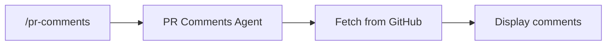
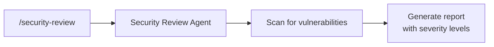
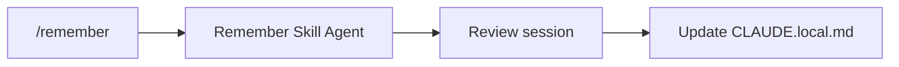
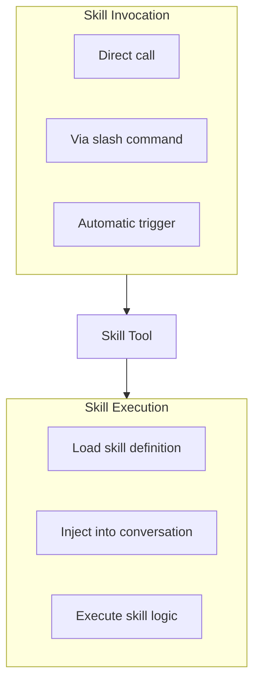

# Slash Commands & Skills

This diagram maps Claude Code's built-in slash commands and the skill system to their prompts.

## Built-in Slash Commands

### `/pr-comments` - Fetch PR Comments

Fetches and displays comments from a GitHub Pull Request.

**Prompt:** [agent-prompt-pr-comments-slash-command.md](../system-prompts/agent-prompt-pr-comments-slash-command.md)

---

### `/review-pr` - Review Pull Request

Performs a code review on a GitHub Pull Request.

**Prompt:** [agent-prompt-review-pr-slash-command.md](../system-prompts/agent-prompt-review-pr-slash-command.md)

---

### `/security-review` - Security Analysis

Comprehensive security review focusing on exploitable vulnerabilities (OWASP Top 10, etc.).

**Prompt:** [agent-prompt-security-review-slash.md](../system-prompts/agent-prompt-security-review-slash.md)

*Note: This is the largest slash command prompt at ~2610 tokens, reflecting the depth of security analysis.*

---

### `/remember` - Save Learnings

Reviews session memories and updates `CLAUDE.local.md` with recurring patterns and learnings.

**Prompt:** [agent-prompt-remember-skill.md](../system-prompts/agent-prompt-remember-skill.md)

---

## Skill System

The Skill tool allows execution of both built-in and custom skills.

**Prompt:** [tool-description-skill.md](../system-prompts/tool-description-skill.md)

---

## Quick Reference

| Command | Purpose | Prompt File |
|---------|---------|-------------|
| `/pr-comments` | Fetch GitHub PR comments | [agent-prompt-pr-comments-slash-command.md](../system-prompts/agent-prompt-pr-comments-slash-command.md) |
| `/review-pr` | Review a Pull Request | [agent-prompt-review-pr-slash-command.md](../system-prompts/agent-prompt-review-pr-slash-command.md) |
| `/security-review` | Security vulnerability analysis | [agent-prompt-security-review-slash.md](../system-prompts/agent-prompt-security-review-slash.md) |
| `/remember` | Save session learnings | [agent-prompt-remember-skill.md](../system-prompts/agent-prompt-remember-skill.md) |
| *Skill Tool* | Execute custom skills | [tool-description-skill.md](../system-prompts/tool-description-skill.md) |

## Related Prompts

These utility prompts support the slash command system:

| Prompt | Purpose | File |
|--------|---------|------|
| **CLAUDE.md Creation** | Generate project documentation | [agent-prompt-claudemd-creation.md](../system-prompts/agent-prompt-claudemd-creation.md) |
| **Agent Creation** | Create custom agents | [agent-prompt-agent-creation-architect.md](../system-prompts/agent-prompt-agent-creation-architect.md) |
| **Prompt Suggestions** | Generate follow-up prompts | [agent-prompt-prompt-suggestion-generator-v2.md](../system-prompts/agent-prompt-prompt-suggestion-generator-v2.md) |
